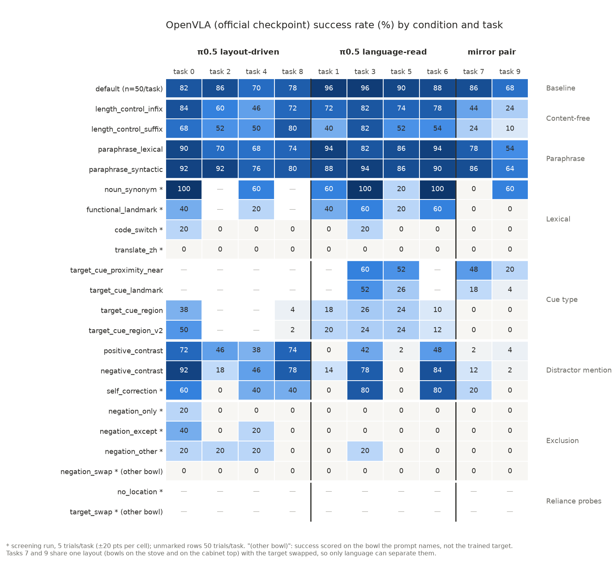
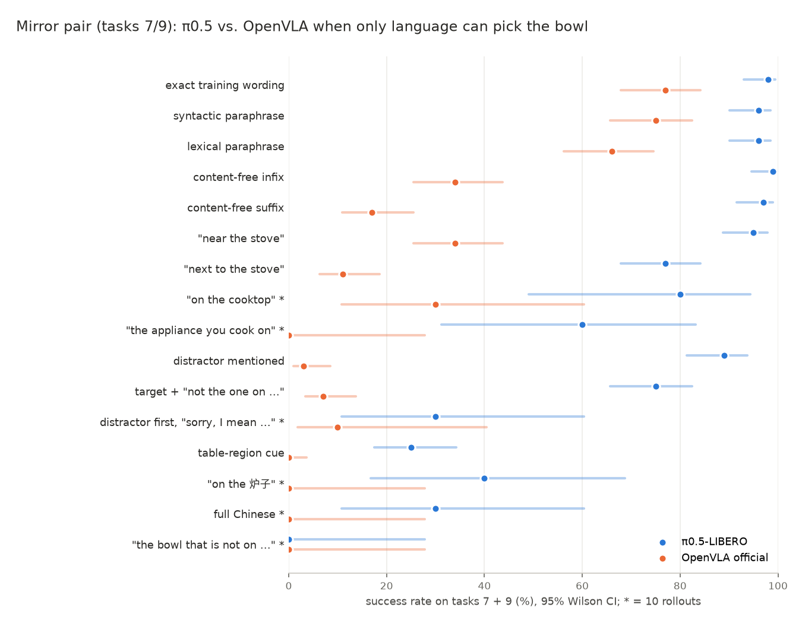

# OpenVLA: language-weakness analysis (2026-10-11)

The same cross-condition reading as `docs/pi05_language_weakness.md`, applied to OpenVLA: the official
LIBERO-Spatial checkpoint (`openvla-official-libero-spatial`) and our LoRA checkpoint
(`openvla-7b-libero-spatial-lora-r32`). Per-condition records stay in `benchmark_split_result.md`
(§2–§5 our checkpoint, §8.5 bowl-attraction probe, §10 official checkpoint, §12 screening); this file
asks what they say together, and where OpenVLA's language failures match or differ from pi05's.

Figures: `docs/figures/openvla_official_language_heatmap.png`,
`docs/figures/mirror_pair_pi05_vs_openvla.png` (`scripts/language_stress/language_weakness_figures.py`).

## 0. Data

| Checkpoint | Source | Conditions | Rollouts |
|---|---|---|--:|
| Official | Full benchmark 2026-10-05 → 10-07 (HF mirror, jsonl) | 22 registry conditions, 50 trials/task | 8,300 |
| Official | Language-stress screen, batches 1 and 3 (2026-10-10, jsonl) | 10 candidates, 5 trials/task | 480 |
| LoRA (ours) | HF mirror jsonl, 2026-10-01 → 10-10 | 10 conditions incl. `negation_only` | 3,900 |
| LoRA (ours) | Per-task tables in `benchmark_split_result.md` (pre-jsonl runs) | `default`, contrasts, region, landmark, "close to" | — |

**Not run on any OpenVLA checkpoint:** `target_swap` and `no_location`, the two probes that split pi05's
tasks into layout-driven and language-read. So OpenVLA's own task grouping is unknown. The group columns
below use pi05's grouping as fixed task sets (0/2/4/8, 1/3/5/6, 7/9) for a like-for-like comparison,
not as a claim about how OpenVLA uses the layout. The **mirror pair (tasks 7/9)** needs no such
assumption: the two tasks share one layout with the target swapped, for every policy.

## 1. Summary

1. **OpenVLA's main weakness is surface form, not meaning.** Content-free filler costs it 12–26 pts on
   the eight unique-layout tasks and **43–60 pts on the mirror pair**, for both checkpoints; pi05 loses
   nothing. Where the sentence alone decides the bowl, any change to the sentence breaks OpenVLA.
2. **Exclusion fails completely, with no layout safety net.** `negation_only` is 2.6% on our checkpoint
   (500 rollouts; no task above 10%) and 1/50 on the official one. pi05 keeps 90% on its layout-driven
   tasks; OpenVLA fails those too. The drop is far larger than OpenVLA's own surface-form cost (length
   controls keep 51–64%), so it is content-specific.
3. **Chinese gives 0%, code-switching 1/50**, on every task. pi05 stays at 78–80% by falling back on the
   layout. OpenVLA has no such fallback when it does not recognise the instruction, or never had a
   layout fallback to begin with; `no_location` would tell which.
4. **Region cues, distractor mentions and self-correction** cost OpenVLA 50–70 pts, far more than pi05,
   and reach 0–10% on the mirror pair.
5. **Shared with pi05:** exclusion (0–1% on the mirror pair for both), region cues being the worst cue
   type, the "next to X" familiarity penalty, and distractor-mention losses concentrated on tasks 5 and
   9. **OpenVLA only:** sensitivity to content-free text, to lexical paraphrase, and to non-English.
6. **Both checkpoints show the same profile.** Per-task drops correlate at r = 0.70–0.84 across the
   official and our checkpoint on five of the six conditions compared (content-free suffix: 0.40).
   The weaknesses belong to OpenVLA trained on LIBERO-Spatial, not to our LoRA run.

## 2. What transfers from the pi05 analysis

- **The mirror pair transfers unchanged.** OpenVLA default on tasks 7/9: 77% (official), 72% (ours).
- **The chance-level argument does not.** For pi05, success below 50% on the mirror pair was read as
  "goes to the other bowl". For OpenVLA the bowl-attraction probe (§8.5, our checkpoint) logged where
  the arm went: among `negative_contrast` failures, 58.1% never came within 8 cm of either bowl and only
  14.5% approached the distractor first. Below-50% scores for OpenVLA mostly mean *no commitment*, not
  *wrong bowl*.
- **The layout-driven/language-read split cannot be checked.** OpenVLA has no `target_swap` or
  `no_location` data (§0).

## 3. Weaknesses

Group columns use pi05's task sets. "Unique layout" = the eight tasks other than 7 and 9.

### 3.1 O1 — Surface-form fragility, strongest where language decides

| Condition | Unique-layout drop, official / ours | Mirror-pair drop, official / ours | pi05, unique / mirror |
|---|--:|--:|--:|
| `length_control_infix` (content-free clause mid-sentence) | 14.8 / 12.5 | **43.0 / 56.0** | −0.8 / −1.0 |
| `length_control_suffix` (content-free clause at the end) | 26.0 / 23.0 | **60.0 / 60.0** | −1.0 / 1.0 |
| `paraphrase_lexical` | 3.5 / 11.3 | 11.0 / 13.0 | 1.0 / 2.0 |

Drops in percentage points from each policy's own `default`. On the mirror pair, the content-free
suffix leaves OpenVLA at 17% (official) and 12% (ours). The filler names no object or location, so this
says nothing about grounding; it shows the instruction works as an exact key, which fails when the key
changes. On the unique-layout tasks part of the behaviour survives, presumably from the layout. On the
mirror pair nothing replaces it. This matches §8.6's "template-mismatch action collapse" and adds that
the collapse is three to four times larger where the layout cannot help. Lexical paraphrase also hits
single tasks hard: task 2 "from the middle of the table" 44% (ours) / 70% (official).

### 3.2 O2 — Exclusion is never composed, on any task

| Condition | Official (5/task) | Ours (50/task) | pi05 (full / screen) |
|---|--:|--:|--:|
| `negation_only` ("the black bowl that is not on top of the wooden cabinet") | 1/50 | **2.6%** (13/500) | 44.8% |
| `negation_except` ("any black bowl except the one …") | 3/50 | — | 22/50 |
| `negation_other` ("the other black bowl, not the one …") | 4/50 | — | 23/50 |
| `negation_swap` (negates the target's own location; scored on the other bowl) | 0/50 | — | 0/50 |

- On pi05's layout-driven tasks 0, 2, 4, 8 OpenVLA scores 5.0% under `negation_only` (ours, 10/200)
  where pi05 scores 90%. Whatever protects pi05 there does not protect OpenVLA.
- Off-template phrasing alone does not explain it: the length controls keep OpenVLA at 51–64% overall
  and 60–68% on those four tasks.
- When the target's own location is also named, appending "not the one …" does not hurt further:
  `negative_contrast` is *above* `positive_contrast` (official 42.4% vs 32.8%; ours 36.8% vs 32.4%).
  OpenVLA can carry a negated clause it ignores; it cannot select a bowl through one.
- Which bowl the arm goes for under `negation_only` was not logged. §8.5's pattern makes
  "commits to neither" at least as likely as "goes to the named bowl".

### 3.3 O3 — Mentioning the distractor collapses specific tasks

| Condition | 0/2/4/8 | 1/3/5/6 | Mirror 7/9 | All |
|---|--:|--:|--:|--:|
| default (official / ours) | 79.0 / 86.0% | 92.5 / 88.0% | 77.0 / 72.0% | 84.0% / 84.0% |
| `positive_contrast` | 57.5 / 56.0% | 23.0 / 22.0% | **3.0 / 6.0%** | 32.8 / 32.4% |
| `negative_contrast` | 58.5 / 49.0% | 44.0 / 40.0% | **7.0 / 6.0%** | 42.4 / 36.8% |
| `self_correction` * (official) | 7/20 | 8/20 | 1/10 | 32% |

- The positive-contrast drop (45–48 pts on unique layouts) is about twice the matched content-free
  suffix drop (23–26), so most of it is due to the distractor's location words.
- Tasks 1, 5, 7 and 9 go to 0–14% under both contrasts on both checkpoints (one exception: task 1
  under `negative_contrast` on ours, 32%). pi05's largest contrast
  losses are on tasks 5 and 9 too (58–66%). The direction is shared; the size is not.
- **The tasks that are layout-driven for pi05 are also OpenVLA's most robust under
  `positive_contrast`** (56–58% vs 22–23% on 1/3/5/6; Fisher p ≈ 3e-12 on both checkpoints; weaker
  under `negative_contrast`, p = 0.005 official, 0.09 ours), but *not* under content-free filler
  (p = 0.2–0.3). Some layout cue on tasks 0, 2, 4, 8 may also stabilise OpenVLA
  when distractor words compete. `no_location` on OpenVLA would test this directly.
- `self_correction` zeroes tasks 1, 2, 5 and 9; the same tasks fail under distractor mention.

### 3.4 O4 — Region cues: content-specific and total on the mirror pair

`target_cue_region` 15.0% (official) / 17.0% (ours), against 51–64% for the length controls. The mirror
pair is 0/100 on both checkpoints in every wording (ours v3: 1/100). pi05 has its worst prompt-type
result here as well (25–34% on the mirror pair). Region words are the shared blind spot.

### 3.5 O5 — No tolerance for unfamiliar vocabulary or language

| Condition (official, 5/task) | All | Mirror 7/9 | pi05 all / mirror |
|---|--:|--:|--:|
| `noun_synonym` ("cooktop", "cupboard", "biscuit box", "small baking dish") | 62.5% | 3/10 | 87.5% / 8/10 |
| `functional_landmark` ("the appliance you cook on") | 30% | 0/10 | 87.5% / 6/10 |
| `code_switch` ("pick up the 黑色碗 on the 炉子 …") | 4% | 0/10 | 80% / 4/10 |
| `translate_zh` | 0% | 0/10 | 78% / 3/10 |

The gradient has the same order as pi05's (exact > synonym > functional > code-switch ≈ Chinese) and
falls much faster. The decisive difference is that the Chinese prompts also zero OpenVLA on the unique
layouts (0/20 on tasks 0, 2, 4, 8 under `translate_zh`), where pi05 keeps 85%. For pi05 the Chinese
result tracks `no_location`. For OpenVLA either no layout fallback exists, or a Chinese sentence is
worse than no location at all (Llama-2's tokenizer splits Chinese into many byte-level tokens, so the
input is far off-distribution). `no_location` on OpenVLA separates the two.

### 3.6 O6 — "next to X" is worse than novel proximity words

Surface tasks 3, 5, 7, 9: `target_cue_landmark` ("next to X") 25.0% official / 30.5% ours, against
31.0–45.0% / 37.5–53.0% for "close to / near / beside / adjacent to". Same direction as pi05 (87.0% vs
96–97%). Already finding 18 (template *binding*): "next to X" is the native wording of tasks 0/1/6/8 and
appears to recall their motions.

## 4. pi05 against OpenVLA on the mirror pair

| Kind of change | OpenVLA official | pi05 | Shared weakness? |
|---|--:|--:|---|
| None (default) | 77% | 98% | — |
| Paraphrase (syntactic / lexical) | 75 / 66% | 96 / 96% | OpenVLA only, small |
| Content-free filler (infix / suffix) | 34 / 17% | 99 / 97% | **OpenVLA only** |
| Proximity synonym "near" | 34% | 95% | OpenVLA only |
| "next to X" | 11% | 77% | both (familiarity) |
| Noun synonym * | 3/10 | 8/10 | both, OpenVLA larger |
| Distractor mentioned (positive / negative contrast) | 3 / 7% | 89 / 75% | both, OpenVLA far larger |
| Self-correction * | 1/10 | 3/10 | **both** |
| Region cue | 0% | 25% | **both** |
| Chinese / code-switch * | 0 / 0 of 10 | 3 / 4 of 10 | both on the mirror pair; only OpenVLA elsewhere |
| Exclusion (`negation_only` *) | 0/10 | 0/10 | **both, total** |

Reading: pi05 removed OpenVLA's dependence on exact wording, but not its inability to compose
exclusion, to ground table-region words, or to handle a retracted reference. Those three are the
benchmark's model-independent language failures so far.

## 5. Our checkpoint against the official one

| Condition | Official | Ours | Per-task drop correlation |
|---|--:|--:|--:|
| `length_control_infix` | 63.6% | 62.8% | 0.82 |
| `length_control_suffix` | 51.2% | 53.6% | 0.40 |
| `paraphrase_lexical` | 79.0% | 72.4% | 0.70 |
| `positive_contrast` | 32.8% | 32.4% | 0.83 |
| `negative_contrast` | 42.4% | 36.8% | 0.83 |
| `target_cue_region` | 15.0% | 17.0% | 0.84 |

Both default to 84.0%. The checkpoints differ by at most 7 pts per condition and fail on the same
tasks.

## 6. Limitations

- No `target_swap` / `no_location` on OpenVLA, so its layout reliance is inferred only indirectly (O3,
  O5).
- Outcome-only results in the main eval. §8.5's instrumented probe covers our checkpoint on `default`,
  `negative_contrast`, `target_cue_landmark` and `target_cue_proximity_novel` only, 10 episodes/task.
- Screens are 5 trials/task (10 rollouts on the mirror pair). Our checkpoint's early per-task numbers
  come from the result doc's tables (percentages of 50), not from jsonl.
- One seed, one init-state set.

## 7. Next steps

1. **Screen `target_swap` and `no_location` on both OpenVLA checkpoints** (100 rollouts each, 5/task).
   This is the largest gap. It answers whether OpenVLA has layout-driven tasks at all, and whether its
   0% on Chinese means "no fallback" or "worse than no location".
2. With the which-bowl logging now being added in a separate session, re-run `negation_only` and
   `target_cue_region` on the mirror pair for OpenVLA and pi05 together: wrong bowl vs. no commitment
   is the open question for every shared weakness in §4.
3. Run the bowl-attraction probe on the length controls (open since §8.6) to confirm whether the
   mirror-pair filler collapse is the same "never commits" mode.
4. Shared failures (exclusion, region cue, self-correction) are the candidates for model-independent
   benchmark splits; `negation_swap` and a mirror-pair-only `self_correction` run are the cheapest next
   promotions.
