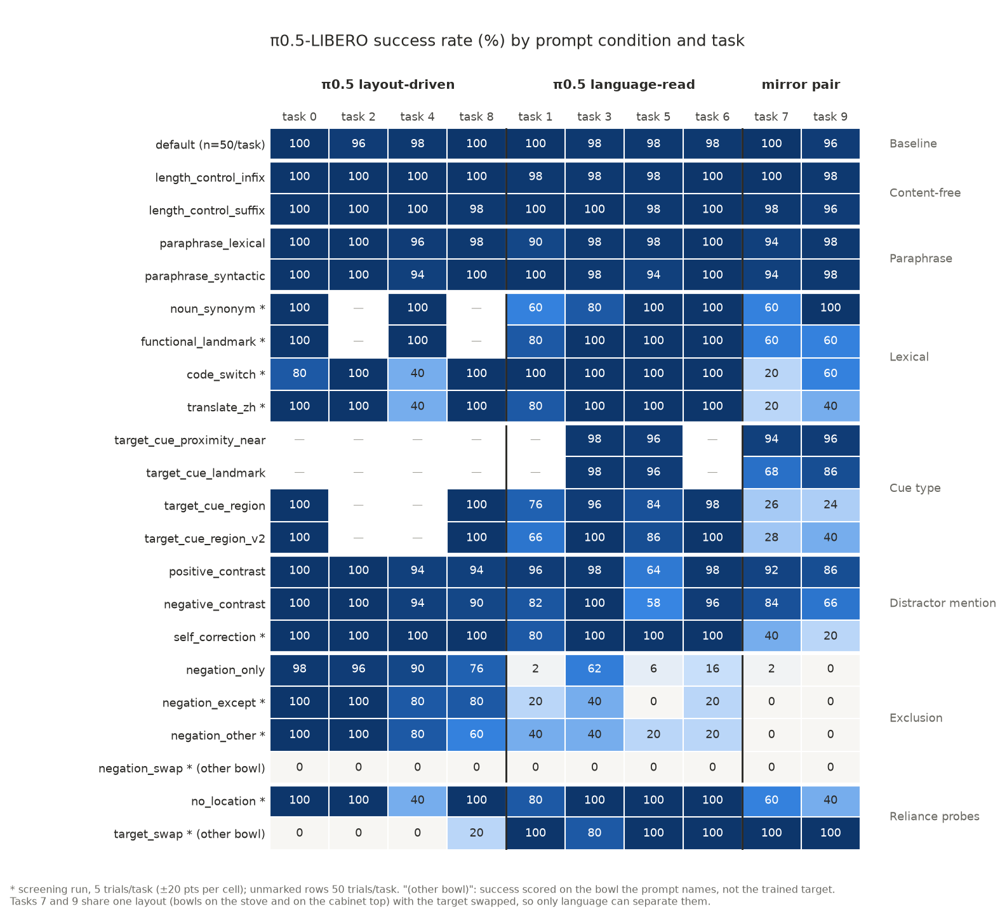
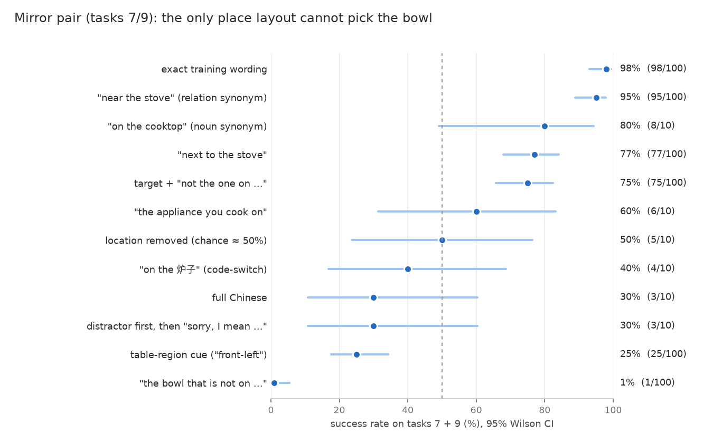

# `pi05_libero`: language-weakness analysis (2026-10-11)

A cross-condition reading of every `pi05_libero` rollout run so far. It does not replace the
per-condition records in `benchmark_split_result.md` (§9 full benchmark, §12 screening, `negation_only`
setting), which stay the source for each number; this file asks what the conditions say *together*
about where pi05's language handling breaks.

Figures: `docs/figures/pi05_language_heatmap.png`, `docs/figures/pi05_mirror_pair.png`, regenerated by
`scripts/language_stress/language_weakness_figures.py <results_dir> docs/figures`.

## 0. Data

| Source | Conditions | Trials/task | Rollouts |
|---|---|--:|--:|
| Full benchmark, 2026-09-30 → 10-01 (`--pi05_libero--shard{0..3}of4`) | 22 registry conditions | 50 | 8,300 |
| `spatial/negation_only`, 2026-10-10 (`--pi05_libero`) | 1 | 50 | 500 |
| Language-stress screen, batches 1–3, 2026-10-10 (`--pi05_libero--screen`) | 12 candidates | 5 | 580 |
| **Total** (the 16-rollout `pi05_smoke` run excluded) | | | **9,380** |

All from the HF mirror `Qian0203/vla_ws-eval-results`, `results/`, deduplicated on
`(task_id, episode_idx)`. Same scene, init states and seed (7) as every other policy. Every failed
rollout in every condition ran to the 230-step limit, so a failure never says *which* bowl, if any,
the arm went for (§6).

## 1. Summary

1. **pi05 reads the location phrase on only six of the ten `libero_spatial` tasks.** On tasks 0, 2, 4
   and 8 it carries out the layout's trained motion whatever the sentence says (`target_swap`: 1/20
   delivers the bowl the prompt names, against 29/30 on the other six). Every prompt manipulation is
   close to free on those four tasks, which inflates every 10-task average.
2. **Tasks 7 and 9 are the only clean language test in the suite.** They share one layout, a bowl on
   the stove and a bowl on the cabinet top, with the target swapped, so nothing but the sentence can
   separate them. With the location removed pi05 is at chance there (5/10). This pair, not the
   10-task mean, shows the weaknesses below at full size.
3. **Exclusion is never composed; the negated phrase acts as a pointer.** "the bowl that is not on X"
   delivers the target in 1/100 rollouts on tasks 7/9 and 44/300 on the six language-read tasks,
   against 180/200 on the layout-driven four. Every rewording ("any … except", "the other …, not the
   one") does the same, and negating the target's own location (`negation_swap`) gives 0/50.
4. **The table-region cue is worse than no cue.** "front-left of the table" style cues give 25–34% on
   tasks 7/9, below the 50% of removing the location altogether.
5. **The 78% on Chinese is the layout prior, not Chinese understanding.** Per task, `translate_zh`
   tracks `no_location` (r = 0.93, mean absolute difference 4 pts) and not `target_swap` (r = −0.20).
   On tasks 7/9 it is 3/10.
6. **Landmark grounding degrades with lexical distance from the training nouns**: on tasks 7/9, exact
   wording 98% → relation-word synonyms 94–96% → noun synonyms 8/10 → functional descriptions 6/10 →
   Chinese nouns in English syntax 4/10 → full Chinese 3/10.
7. **Mentioning the distractor costs pi05, and only where it reads language**; a self-correction that
   names the distractor first fails on tasks 7/9 (3/10).
8. **Not weaknesses:** content-free filler (99.0–99.2%), same-cue paraphrase (97.2–97.8%), and
   relation-word synonyms such as "near/beside/adjacent to/close to" (96–97%) cost about nothing on
   any task group, the mirror pair included.

## 2. The lens: layout prior against language

`libero_spatial` places every fixture (plate, cookie box, ramekin, cabinet, stove) in the same region
in every task; only the two black bowls move. As an unordered pair, the bowl locations are:

| id | target | distractor | layout shared with |
|--:|---|---|---|
| 0 | between plate and ramekin | next to ramekin | — |
| 1 | next to ramekin | next to cookie box | — |
| 2 | table center | next to plate | — |
| 3 | on cookie box | on cabinet top | — |
| 4 | in top drawer (open) | on cabinet top | — |
| 5 | on ramekin | on cookie box | — |
| 6 | next to cookie box | on stove | — |
| 7 | on stove | on cabinet top | **task 9** |
| 8 | next to plate | next to ramekin | — |
| 9 | on cabinet top | on stove | **task 7** |

(From the `(:init ...)` blocks of `LIBERO/libero/libero/bddl_files/libero_spatial/*.bddl`.)

Eight layouts are unique, so the image alone identifies the task and its trained target. A policy can
score near 100% on those without reading the location phrase. Two screening probes measure how far
pi05 does:

- `target_swap`: the prompt truthfully names the *other* bowl and success is scored on that bowl.
- `no_location`: "pick up the black bowl and place it on the plate", scored on the trained target.

| Group | Tasks | `target_swap` | `no_location` | default |
|---|---|--:|--:|--:|
| Layout-driven | 0, 2, 4, 8 | **1/20** | 17/20 | 98.5% |
| Language-read | 1, 3, 5, 6 | 19/20 | 19/20 | 98.5% |
| Mirror pair | 7, 9 | 10/10 | **5/10** | 98.0% |

On the four layout-driven tasks pi05 ignores a truthful instruction to fetch the other bowl. On the
other six it follows it. On the mirror pair, where the layout carries no information, removing the
location drops it to chance. The remaining sections read every condition through these three groups.
Group membership rests on the 5-trial `target_swap` screen (§6); the full-run `negation_only` profile
(§3.1) agrees with it on every task except task 3, which sits between the groups in both.

No single geometric rule separates the layout-driven tasks from the language-read ones: three of the
four have both bowls on the table surface, but so does task 1. Rollout videos would settle what the
policy does on 0, 2, 4 and 8 when told to take the other bowl.

## 3. Weaknesses

Success rates per group; 95% Wilson intervals for the cells the argument rests on. Unmarked rows are
50 trials/task; `*` rows are 5 trials/task.

### 3.1 W1 — Exclusion is not composed (severity: highest)

| Condition (task 7 wording) | Layout-driven | Language-read (6) | Mirror 7/9 | All |
|---|--:|--:|--:|--:|
| `negation_only` ("the black bowl that is not on top of the wooden cabinet") | 90.0% (180/200) | 14.7% (44/300; 11–19) | **1/100** (0–5) | 44.8% |
| `negation_except` * ("any black bowl except the one on top of …") | 18/20 | 4/30 | 0/10 | 44% |
| `negation_other` * ("the other black bowl, not the one on top of …") | 17/20 | 6/30 | 0/10 | 46% |
| `negation_swap` * (negates the *target's* location; scored on the other bowl) | 0/20 | 0/30 | 0/10 | 0% |

- **The 44.8% is entirely the layout prior.** Across the ten tasks `negation_only` (full run)
  correlates with `target_swap` at r = −0.95 (Spearman −0.93, p = 1e-4): it succeeds exactly where pi05
  ignores the sentence.
- **The negated location acts as a positive pointer.** On the mirror pair the policy must choose from
  the words; with "not on the cabinet" it delivers the stove bowl in 1/100, far below the 50% it gets
  with no location at all. That is consistent with going to the place named and dropping "not" (direct
  confirmation needs which-bowl logging, §6).
- **Not a "not" problem.** "except" and "the other …, not the one" track `negation_only` per task
  (r = 0.97 and 0.92). Any referent defined by exclusion fails.
- **`negation_swap` closes the alternative.** If pi05 used negation at all, some task would deliver the
  other bowl; none does, in any group. Layout-driven tasks deliver the trained bowl; language-read
  tasks go where the sentence points, which is the trained bowl again.
- **The same pattern shows in the 3-bowl hard-negative scene.** The disambiguating prompt there adds a
  "not the one on the table in front of it" clause. It lowers the language-read group from 71.0% to
  60.7%, driven by task 1 (42% → 2%) and task 9 (34% → 6%), and leaves the layout-driven group
  unchanged (73.5% → 74.5%).
- A positive contrast that *also names the target first* survives: `negative_contrast` keeps 75% on
  the mirror pair. Negation only breaks pi05 when it is the sole route to the target.

### 3.2 W2 — Mentioning the distractor pulls the policy toward it (moderate)

| Condition | Layout-driven | Language-read (6) | Mirror 7/9 | Fisher p, layout vs read |
|---|--:|--:|--:|--:|
| default | 98.5% | 98.3% | 98.0% | 1.0 |
| `positive_contrast` ("…; the other black bowl is on top of the wooden cabinet") | 97.0% | 89.0% | 89.0% | 1e-3 |
| `negative_contrast` ("…, not the one on top of the wooden cabinet, …") | 96.0% | 81.0% | 75.0% (66–82) | 3e-7 |

The length controls add the same number of tokens at the same positions and cost nothing (99.0–99.2%
in every group), so the residual comes from the distractor's location words. The largest per-task
losses are task 5 (64% / 58%) and task 9 (86% / 66%). Negation adds a further 8 pts on the
language-read group (89.0 → 81.0), which is W1 again on a smaller scale.

### 3.3 W3 — Self-correction: the first-named location wins on the mirror pair (screen)

`self_correction` * ("the black bowl on top of the wooden cabinet, sorry, I mean the one on the
stove, …") is 20/20 on the layout-driven tasks, 19/20 on tasks 1, 3, 5, 6, and **3/10 on tasks 7/9**.
Where the layout cannot help, the retracted location, named first, wins more often than chance. 10
rollouts only (95% CI 11–60%); worth a full run on the mirror pair.

### 3.4 W4 — Allocentric table-region cues mislead (severity: high, stable across wordings)

| Condition (task 7 wording) | Layout-driven (0, 8) | Language-read (6) | Mirror 7/9 |
|---|--:|--:|--:|
| `target_cue_region` ("the black bowl at the front-left of the table") | 100% | 67.3% | **25.0%** (18–34) |
| `target_cue_region_v2` | 100% | 70.0% | 34.0% (25–44) |
| `target_cue_region_v3` | 100% | 66.3% | 25.0% (18–34) |
| `no_location` * | 20/20 | 24/30 | 5/10 |

All three wordings put the mirror pair below the no-location chance level, so the region words are not
just ignored, they point at the other bowl more often than not. Two explanations remain open:

- pi05 resolves "front/left/right" in a different frame from the one the cues were written in (camera
  view vs. robot base). The cues are truthful in the frame `benchmark_split_plan.md` §4b uses; whether
  that matches the images the policy sees has not been checked against a rendered frame.
- Region words carry no training signal at all (no `libero_spatial` prompt uses them), and the
  below-chance result is noise around 50%. Against this: v1 and v3 are each 25/100, with intervals
  ending at 34%.

Task 1 also loses 24–34 pts under every region wording, so the effect is not confined to the pair.

### 3.5 W5 — Landmark-noun grounding degrades with lexical distance

On the mirror pair, the only change between the conditions below is how the stove / wooden cabinet is
named. The target's relation word is unchanged.

| Wording of the landmark (task 7) | Mirror 7/9 | All tasks |
|---|--:|--:|
| "on the stove" (default) | 98/100 | 98.4% |
| "near / beside / close to / adjacent to the stove" | 94–96/100 | 96–97% |
| "on the cooktop" (`noun_synonym` *) | 8/10 | 87.5% |
| "on the appliance you cook on" (`functional_landmark` *) | 6/10 | 87.5% |
| no location (`no_location` *) | 5/10 | 82% |
| "on the 炉子" (`code_switch` *) | 4/10 | 80% |
| "拿起炉子上的黑色碗…" (`translate_zh` *) | 3/10 | 78% |

- pi05 binds the landmark *noun* tightly to its training vocabulary. Relation words can be swapped
  freely; the noun cannot.
- **The Chinese headline is the layout prior.** Per task, `translate_zh` follows `no_location`
  (r = 0.93, mean |difference| 4 pts) and is unrelated to `target_swap` (r = −0.20); `code_switch`
  likewise (r = 0.81 with `no_location`). Both lose task 4 (2/5), the one unique-layout task where
  `no_location` also fails (2/5), and both sit at or below chance on the mirror pair. The
  conclusion that pi05 "keeps most of its success" in Chinese (finding 25 in `benchmark_split_result.md`
  as of commit `1c1402e`, not yet on `main`) holds for the 10-task
  mean but not as evidence of understanding Chinese location words: across these tasks it behaves as
  if the location had been deleted.
- The 10-task means for every row above lie between 78% and 98%; on the mirror pair the same rows span
  30–98%.

### 3.6 W6 — The familiar "next to X" template is worse than novel synonyms

`target_cue_landmark` ("next to the stove") gives 77/100 on the mirror pair, against 94–96/100 for
"near", "beside", "close to" and "adjacent to"; task 7 alone is 68%. "next to X" is the native wording of
the table-surface tasks 0, 1, 6, 8; the drop fits the phrase recalling those tasks' motions rather than
its meaning. Same direction as OpenVLA's familiarity gap (§9.4: +9.5 pts pi05, +13.9 OpenVLA).

### 3.7 W7 — The language channel is underused, which hides W1–W6 in 10-task averages

This is the precondition for the rest, not a separate failure mode. Because pi05 ignores the location
on four tasks and those four tasks absorb every manipulation, each 10-task mean understates the
language effect. Scored on the trained target, the conditions spread from 1% to 98% on the mirror
pair, against 45–99% for their 10-task means. A benchmark number for pi05 language robustness that does not split out the
language-read tasks mostly measures layout recognition.

## 4. Language-sensitive scores

The same runs restricted to tasks where language decides the outcome (pi05's six language-read tasks,
and the mirror pair alone):

| Condition | All tasks | Language-read (1, 3, 5–7, 9) | Mirror 7/9 |
|---|--:|--:|--:|
| default | 98.4% | 98.3% | 98.0% |
| `length_control_infix` / `_suffix` | 99.2 / 99.0% | 98.7 / 98.7% | 99 / 97% |
| `paraphrase_lexical` / `_syntactic` | 97.2 / 97.8% | 96.3 / 97.3% | 96 / 96% |
| `target_cue_proximity_*` (four synonyms) | 96–97% | 96–97% | 94–96% |
| `positive_contrast` | 92.2% | 89.0% | 89% |
| `target_cue_landmark` | 87.0% | 87.0% | 77% |
| `negative_contrast` | 87.0% | 81.0% | 75% |
| `noun_synonym` * | 87.5% | 25/30 | 8/10 |
| `functional_landmark` * | 87.5% | 25/30 | 6/10 |
| `self_correction` * | 84% | 22/30 | 3/10 |
| `no_location` * | 82% | 24/30 | 5/10 |
| `code_switch` * | 80% | 24/30 | 4/10 |
| `translate_zh` * | 78% | 22/30 | 3/10 |
| `target_cue_region` (v1 / v2 / v3) | 75.5 / 77.5 / 74.8% | 67.3 / 70.0 / 66.3% | 25 / 34 / 25% |
| `negation_other` * / `negation_except` * | 46 / 44% | 6/30, 4/30 | 0/10, 0/10 |
| `negation_only` | 44.8% | 14.7% | 1% |
| `negation_swap` * | 0% | 0/30 | 0/10 |

Ranking pi05's weaknesses by mirror-pair score: exclusion (0–1%) < region cue (25–34%) < Chinese /
self-correction / code-switch (30–40%, n = 10) < functional landmark (60%) < "next to X" and negative
contrast (75–77%) < noun synonym (80%) < distractor mention (89%).

## 5. Against OpenVLA (official checkpoint)

The official OpenVLA LIBERO-Spatial checkpoint on the same conditions, all tasks (§10, §12):

| Condition | OpenVLA official | pi05_libero |
|---|--:|--:|
| default | 84.0% | 98.4% |
| `length_control_suffix` | 51.2% | 99.0% |
| `positive_contrast` | 32.8% | 92.2% |
| `target_cue_region` | 15.0% | 75.5% |
| `translate_zh` * | 0% | 78% |
| `code_switch` * | 4% | 80% |
| `self_correction` * | 32% | 84% |
| `negation_only` * | 2% | 44% |
| `negation_swap` * | 0% | 0% |

pi05 is far more robust to surface form (length, phrasing, language) and fails the same way on
exclusion. The full OpenVLA reading, with the same lens, is `docs/openvla_language_weakness.md`. `target_swap` and `no_location` have not been screened on OpenVLA, so this file cannot say
whether OpenVLA's tasks split into the same layout-driven and language-read groups. The OpenVLA
mirror-pair numbers (tasks 7/9, 50 trials each) are there to compare already, e.g. `target_cue_region`
0/50 and 0/50.

## 6. Limitations

- **Outcome only.** Every failure is a 230-step timeout; the results do not record which bowl was
  grasped or placed. "The negated phrase acts as a pointer" (W1), "the first-named location wins" (W3)
  and "region words point at the other bowl" (W4) are inferred from below-chance success on the mirror
  pair and from `target_swap` / `negation_swap`, not observed.
- **Screens are 5 trials/task**: ±20 pts per task, 10 rollouts on the mirror pair (95% CIs about ±30
  pts). The task grouping depends on the `target_swap` screen; task 3 (4/5 there, 62% under
  `negation_only`) and task 8 (1/5, 76%) are the least certain members.
- One seed (7), one init-state set, one run per condition.
- pi05_libero was trained on all 40 LIBERO tasks; several `target_swap` prompts are word for word
  another task's training instruction. Its "reading" of the location may be matching whole training
  sentences rather than composing them.
- The region cues' frame of reference has not been checked against rendered frames (W4).

## 7. Next steps, by expected information per GPU-hour

1. **Log which bowl ends up on the plate, and which one is grasped first**, in each rollout row (the
   distractor's `On(bowl_2, plate)` predicate plus first-contact object). No new rollouts needed for
   new conditions, and it turns W1/W3/W4 from inferences into observations.
2. **Full runs (50 trials/task) of `target_swap` and `no_location` on pi05 and on OpenVLA.** They define
   the grouping every analysis here depends on; currently 5 trials/task and pi05 only.
3. **A mirror-pair split.** Tasks 7/9 are the only layout-ambiguous pair in `libero_spatial`. New suites
   with more such pairs (two bowls in the same places, target swapped, e.g. stove/cookie box, ramekin/
   cabinet top) would give a language score that the layout prior cannot inflate. Placing bowls on the
   shared region catalog (`CLAUDE.md`, "Coding & import conventions") keeps the geometry verified.
4. **Promote `negation_swap`** (0% for both families) and run `self_correction` at 50 trials/task on
   tasks 7/9.
5. **Region-cue frame check**: render task 7 and 9 initial frames as the policy sees them and confirm
   "front-left" / "front, right of center" match the target bowl.
6. Still unscreened from v1: `distractor_first`, `coreference`, `translate_es`.
